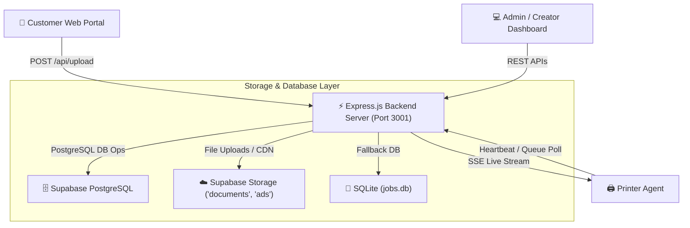

# 🛠️ CampusPrint / XeroxGO Backend Architecture & Technical Reference

This document provides complete, exhaustive details of the **CampusPrint / XeroxGO Backend System**.

---

## 📐 1. System Architecture Overview

The backend is built using **Express.js (v5.2.1)** running on **Node.js (22.x)**. It serves as the central hub connecting:
1. **Frontend Web Apps**: Customer print portal & Admin/Creator dashboards.
2. **Printer Agents**: Background agent services running on physical printer host machines.
3. **Database & Storage**: Dual-mode data persistence via **Supabase PostgreSQL** and **Supabase Cloud Storage** (with legacy local SQLite fallback).



---

## 🗄️ 2. Database Schema & Data Models

The database schema is defined in [`supabase_schema.sql`](file:///d:/UserData/print/backend/supabase_schema.sql).

### 2.1. `jobs` Table
Stores print job details, print specifications, user preferences, printer assignment state, and lifecycle status.

| Column | Type | Default | Description |
| :--- | :--- | :--- | :--- |
| `id` | `BIGSERIAL` | Primary Key | Unique internal job ID |
| `token` | `TEXT` | `UNIQUE NOT NULL` | Public 6-character user tracking token (e.g., `CPX7A9`) |
| `username` | `TEXT` | `'Guest'` | Name of customer |
| `originalName` | `TEXT` | `NULL` | Original uploaded document filename |
| `filename` | `TEXT` | `NULL` | Server-assigned unique stored filename |
| `fileUrl` | `TEXT` | `NULL` | Public CDN URL from Supabase Storage |
| `copies` | `INTEGER` | `1` | Number of print copies requested |
| `paymentMethod`| `TEXT` | `'UPI'` | Payment mode (`'UPI'`, `'Cash'`) |
| `mode` | `TEXT` | `'B&W'` | Color mode (`'B&W'`, `'Color'`) |
| `sides` | `TEXT` | `'Single-sided'`| Print sides (`'Single-sided'`, `'Double-sided'`) |
| `price` | `NUMERIC(10,2)`| `0.00` | Calculated total job cost |
| `status` | `TEXT` | `'Pending'` | Lifecycle state: `Pending` ➔ `ReadyToPrint` ➔ `Printing` ➔ `Completed` / `Failed` |
| `pageRange` | `TEXT` | `'All'` | Custom page range string (e.g., `'1-5, 8'`) |
| `fileType` | `TEXT` | `NULL` | Extension (`PDF`, `DOCX`, `PNG`, etc.) |
| `pageCount` | `INTEGER` | `1` | Total document pages |
| `is_deleted` | `INTEGER` | `0` | Soft-delete flag |
| `revenue_cleared`| `INTEGER` | `0` | Indicates if revenue has been settled/cleared |
| `assignment_mode`|`TEXT` | `'Auto'` | Assignment strategy (`'Auto'`, `'Manual'`) |
| `assigned_printer_id`|`BIGINT` | `NULL` | ID of assigned printer |
| `assigned_printer_name`|`TEXT` | `'Auto'` | Display name of assigned printer |
| `pagesPerSheet`|`TEXT` | `'1'` | N-Up layout (`'1'`, `'2'`) |
| `twoUpLayout` | `TEXT` | `'sideBySide'`| 2-Up orientation layout (`'sideBySide'`, `'topBottom'`) |
| `orientation` | `TEXT` | `'auto'` | Target orientation (`'auto'`, `'portrait'`, `'landscape'`) |
| `pageOrder` | `TEXT` | `NULL` | Custom JSON string of reordered pages |
| `excludedPages`|`TEXT` | `NULL` | Custom JSON string of omitted pages |
| `pageRotations`|`TEXT` | `NULL` | Custom JSON string of per-page rotation angles |
| `scale` | `TEXT` | `'Fit'` | Print scaling (`'Fit'`, `'Actual'`) |
| `createdAt` | `TIMESTAMPTZ` | `NOW()` | Job creation timestamp |

### 2.2. `printers` Table
Tracks real-time health and assignment stats for connected physical printer agents.

| Column | Type | Default | Description |
| :--- | :--- | :--- | :--- |
| `id` | `BIGSERIAL` | Primary Key | Unique printer ID |
| `name` | `TEXT` | `UNIQUE NOT NULL` | Display name of the printer |
| `system_name` | `TEXT` | `NULL` | OS driver / system spooler name |
| `status` | `TEXT` | `'Offline'` | Live status: `Idle`, `Printing`, `Paused`, `Offline`, `Error` |
| `is_online` | `INTEGER` | `0` | Boolean indicator (1 = Online, 0 = Offline) |
| `is_paused` | `INTEGER` | `0` | Manual pause flag toggled by Admin |
| `last_heartbeat`| `TIMESTAMPTZ` | `NULL` | Timestamp of last heartbeat ping |
| `current_job_id`| `BIGINT` | `NULL` | ID of job currently printing |

### 2.3. `pricing` Table
Global pricing configuration (Single row where `id = 1`).

| Column | Default | Description |
| :--- | :--- | :--- |
| `bwPerPage` | `1.00` | Rate for B&W pages |
| `colorPerPage` | `5.00` | Rate for Color pages |
| `singleSidePerPage`| `1.00` | Base single-sided paper multiplier |
| `doubleSidePerPage`| `1.00` | Double-sided paper multiplier |
| `onePagePerSheet` | `1.00` | 1-Up sheet multiplier |
| `twoPagesPerSheet` | `1.00` | 2-Up sheet multiplier |
| `currency` | `'₹'` | Currency symbol |

### 2.4. `users` Table
Stores hashed credentials for Admin and Creator roles. Default seeds:
- `admin`: Password hash for `CampusPrint@2026`
- `creator`: Password hash for `Creator@2026`

### 2.5. `ads` Table
Promotional banner creatives uploaded by Creators (`id`, `filename`, `fileUrl`, `redirectLink`, `views`, `createdAt`).

---

## ⚙️ 3. Core Backend Engines & Business Logic

### 3.1. Authoritative Pricing Engine (`calculateJobPrice`)
Implemented in [`index.js:L71-L106`](file:///d:/UserData/print/backend/index.js#L71-L106).
```javascript
function calculateJobPrice(pageCount, copies, mode, sides, pagesPerSheet, pricing) {
    const numPages = Math.max(1, parseInt(pageCount, 10) || 1);
    const numCopies = Math.max(1, parseInt(copies, 10) || 1);
    const nUp = (pagesPerSheet === '2' || pagesPerSheet === 2) ? 2 : 1;
    const isColor = String(mode || '').toLowerCase() === 'color';
    const isDoubleSided = String(sides || '').toLowerCase().includes('double');

    // Step 1: Calculate printed sides from document pages and N-Up layout
    const printedSides = Math.ceil(numPages / nUp);

    // Step 2: Calculate physical paper sheets from sides mode
    const physicalSheets = isDoubleSided ? Math.ceil(printedSides / 2) : printedSides;

    // Step 3: Apply rates and modifiers
    const baseColorRate = isColor ? pricing.colorPerPage : pricing.bwPerPage;
    const sideModifier = isDoubleSided ? (pricing.doubleSidePerPage / pricing.singleSidePerPage) : 1.0;
    const sheetModifier = nUp === 2 ? (pricing.twoPagesPerSheet / pricing.onePagePerSheet) : 1.0;

    const costPerPhysicalSheet = baseColorRate * sideModifier * sheetModifier;
    return Math.max(1, Math.round(physicalSheets * numCopies * costPerPhysicalSheet * 100) / 100);
}
```

### 3.2. Load Balancer & Auto-Assignment Engine (`autoAssignJobs`)
Implemented in [`services/supabaseDb.js:L479-L553`](file:///d:/UserData/print/backend/services/supabaseDb.js#L479-L553).
- Dynamically selects active, online, non-paused printers (`is_online = 1`, `is_paused = 0`, `status != 'Error'`).
- Finds unassigned jobs (`assignment_mode = 'Auto'`) in `Pending` or `ReadyToPrint` status.
- Calculates current queue depth (`ReadyToPrint` + `Printing`) across active printers.
- Assigns jobs round-robin to the printer with the lowest queue depth.

### 3.3. Heartbeat & Health Monitor (`updatePrintersOnlineStatus`)
Implemented in [`services/supabaseDb.js:L415-L476`](file:///d:/UserData/print/backend/services/supabaseDb.js#L415-L476).
- **Offline Detector**: Automatically marks any printer as `Offline` if `last_heartbeat` is older than 20 seconds.
- **Stale Print Timeout**: Tracks jobs in `Printing` status; if a job remains in `Printing` state for over 3 minutes (180s timeout), it automatically sets the job status to `Failed`.

### 3.4. Server-Sent Events (SSE) Push (`/api/print-queue/stream`)
Implemented in [`index.js:L631-L657`](file:///d:/UserData/print/backend/index.js#L631-L657).
- Maintains a pool of active connection responses (`sseClients`).
- Emits a real-time event `{ type: "JOB_READY" }` whenever an Admin approves a job via `POST /api/jobs/:id/print`.

---

## 📡 4. Complete API Route Reference

### 🔐 4.1. Authentication Routes
| Method | Endpoint | Description | Auth Required |
| :--- | :--- | :--- | :--- |
| `POST` | `/api/admin/login` | Authenticate admin (`admin` / `CampusPrint@2026`), returns token | No |
| `POST` | `/api/admin/verify` | Verify admin session token | Yes (`Bearer`) |
| `POST` | `/api/admin/logout` | Invalidate admin token | Yes |
| `POST` | `/api/creator/login` | Authenticate creator (`creator` / `Creator@2026`), returns token | No |
| `POST` | `/api/creator/verify` | Verify creator token | Yes (`Bearer`) |
| `POST` | `/api/creator/logout` | Invalidate creator token | Yes |

### 💰 4.2. Pricing Routes
| Method | Endpoint | Description | Auth Required |
| :--- | :--- | :--- | :--- |
| `GET` | `/api/pricing` | Get active pricing rates & admin WhatsApp contact | No |
| `PUT` | `/api/pricing` | Update per-page pricing and WhatsApp number in `settings.json` | Admin Token |

### 📄 4.3. Document Upload & Job Lifecycle
| Method | Endpoint | Description | Auth Required |
| :--- | :--- | :--- | :--- |
| `POST` | `/api/upload` | Upload document file, compute price, upload to Supabase, create job | No |
| `GET` | `/api/jobs` | Retrieve all active print jobs for Admin dashboard | No |
| `GET` | `/api/jobs/token/:token` | Fetch job tracking details by token | No |
| `POST` | `/api/jobs/:id/print` | Change status to `ReadyToPrint` & emit SSE trigger | Admin |
| `PATCH`| `/api/jobs/:id` | Update layout, rotation, page range, copies, or status | No |
| `PATCH`| `/api/jobs/:id/assignment`| Toggle `Auto` or `Manual` printer target | No |
| `POST` | `/api/jobs/:id/retry` | Reset `Failed` job to `Pending` status | No |
| `POST` | `/api/jobs/:id/cancel` | Cancel job, set status to `Failed`, set printer to `Idle` | No |
| `POST` | `/api/jobs/:id/document`| Replace document file and update price calculation | No |
| `POST` | `/api/jobs/delete` | Soft delete jobs and remove files from Cloud Storage & disk | Admin |

### 🖨️ 4.4. Multi-Printer Management & Streaming
| Method | Endpoint | Description | Auth Required |
| :--- | :--- | :--- | :--- |
| `GET` | `/api/printers` | Get all printers, live status, queue length, and active job | No |
| `POST` | `/api/printers/heartbeat` | Agent heartbeat ping to report status and active job | No |
| `POST` | `/api/printers/:id/pause` | Pause printer & rebalance queue | Admin |
| `POST` | `/api/printers/:id/resume`| Resume printer & trigger auto-assignment | Admin |
| `POST` | `/api/printers/refresh` | Force check printer online status and balance queue | No |
| `DELETE`| `/api/printers/:id` | Delete printer from registry | Admin |
| `POST` | `/api/printers/purge-offline`| Purge all offline printers | Admin |
| `GET` | `/api/print-queue` | Get print queue for printer (supports `?printerName=` or `?printerId=`) | No |
| `GET` | `/api/print-queue/stream`| Server-Sent Events stream for instant job notifications | Agent |

### 💵 4.5. Revenue Analytics
| Method | Endpoint | Description | Auth Required |
| :--- | :--- | :--- | :--- |
| `GET` | `/api/revenue` | Get Cash, UPI, Total, and Weekly revenue metrics | Admin |
| `POST` | `/api/revenue/reset` | Mark all un-cleared revenue as cleared (`revenue_cleared = 1`) | Admin |

### 📢 4.6. Creator Advertising
| Method | Endpoint | Description | Auth Required |
| :--- | :--- | :--- | :--- |
| `GET` | `/api/ads` | List all ad banners | No |
| `POST` | `/api/ads` | Upload new ad image creative to `ads` bucket | Creator |
| `POST` | `/api/ads/:id/view` | Increment view impression count | No |
| `DELETE`| `/api/ads/:id` | Delete ad banner and remove image from cloud storage | Creator |

### 📂 4.7. File Serving
| Method | Endpoint | Description | Auth Required |
| :--- | :--- | :--- | :--- |
| `GET` | `/api/files/:filename` | Serve local file from `uploads/` or redirect to Supabase CDN | No |
| `GET` | `/api/download/:filename`| Direct download route for document files | No |

---

## 📁 5. Directory Structure & Key Files

- [`backend/index.js`](file:///d:/UserData/print/backend/index.js): Main Express application server, middleware, auth, pricing logic, endpoints.
- [`backend/services/supabase.js`](file:///d:/UserData/print/backend/services/supabase.js): Supabase JS client setup and Storage helper functions (`uploadDocumentToStorage`, `uploadAdToStorage`, `deleteFromStorage`).
- [`backend/services/supabaseDb.js`](file:///d:/UserData/print/backend/services/supabaseDb.js): High-level DB layer handling PostgreSQL queries, printer heartbeats, queue auto-assignment, and health monitoring.
- [`backend/supabase_schema.sql`](file:///d:/UserData/print/backend/supabase_schema.sql): Complete SQL schema, indexes, seed data, and Row Level Security (RLS) policies.
- [`backend/package.json`](file:///d:/UserData/print/backend/package.json): Node.js configuration and dependency list.
- [`backend/settings.json`](file:///d:/UserData/print/backend/settings.json): Persistent runtime settings (e.g. WhatsApp contact number).
- [`backend/uploads/`](file:///d:/UserData/print/backend/uploads/): Directory for temporary Multer disk caching.

---

## 🚀 6. Running & Environment Configuration

### `.env` Parameters
```env
PORT=3001
USE_SUPABASE=true
SUPABASE_URL=https://xaptoxncqgytplmogpax.supabase.co
SUPABASE_SERVICE_ROLE_KEY=eyJhbGciOi...
WHATSAPP_NUMBER=7560923619
```

### Server Execution
```bash
# Install dependencies
npm install

# Start production server
npm start
```
The server will run on `http://localhost:3001` (or specified `PORT`).
