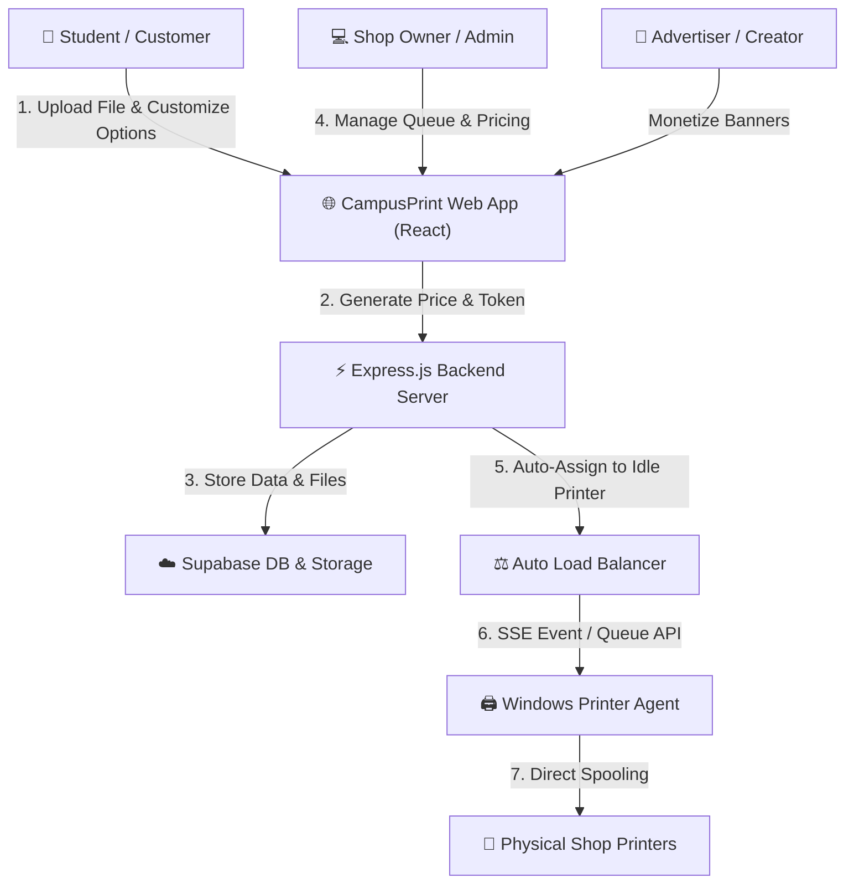

# 🎯 CampusPrint (XeroxGO) - Project Objectives & System Overview

**CampusPrint (XeroxGO)** is a cloud-connected, automated **Smart Campus Printing & Multi-Printer Management Ecosystem**. It bridges the gap between college students needing quick, privacy-safe document printing and campus print-shop operators managing high volume, multi-printer hardware.

---

## 📌 1. Core Problem Statement

College campus print shops face significant operational bottlenecks every day:
1. **Long Physical Queues & Delays**: Students crowd around shop counters waiting to send files via WhatsApp, Bluetooth, or USB thumb drives.
2. **Security & Privacy Vulnerabilities**: Transferring personal files over public shop PCs poses data privacy risks and frequently infects shop computers with USB malware.
3. **Manual Overhead & Error-Prone Pricing**: Shop owners manually inspect page counts, count copies, and calculate prices, leading to accounting errors and slow throughput.
4. **Unbalanced Printer Utilization**: Shop operators manually pick printers for each job, causing certain printers to become overloaded while others sit idle.
5. **Lack of Order Transparency**: Students have no visibility into queue status or estimated completion times once they submit a document.

---

## 🚀 2. Primary Project Objectives

The **CampusPrint** platform achieves five main objectives:

### 📱 1. Seamless Contactless Self-Service for Students
- Enable students to upload documents (`PDF`, `DOCX`, `PPTX`, `JPG`, `PNG`) directly from their mobile phones or laptops.
- Provide interactive document customization (B&W / Color, Single / Double-sided, 1-Up / 2-Up layout, page ranges, rotations, scaling).
- Provide instant, transparent price calculation and support flexible payment options (UPI / Cash).
- Issue a unique 6-character tracking token (e.g. `CPX7A9`) for real-time progress tracking without physical queueing.

### ⚖️ 2. Dynamic Multi-Printer Load Balancing
- Eliminate printer bottlenecks by automatically distributing print jobs across all online, active shop printers.
- Intelligently route incoming jobs to the printer with the minimum queue depth (`ReadyToPrint` + `Printing`).
- Support manual admin overrides when specialized printing (e.g., color-only or high-capacity printers) is required.

### 🤖 3. Zero-Intervention Hardware Automation (Printer Agent)
- Deploy a lightweight, background Windows daemon/service ([`printer-agent`](file:///d:/UserData/print/printer-agent/README.md)) directly on shop PCs.
- Enable automatic queue polling and Server-Sent Events (SSE) real-time triggers to pull documents and print them directly to physical printers without requiring shop operators to open files or click print dialogs manually.
- Monitor printer status with periodic heartbeats (`Idle`, `Printing`, `Paused`, `Offline`, `Error`).

### 📊 4. Centralized Operations & Financial Control for Admins
- Equip print shop managers with an **Admin Dashboard** ([`Admin.jsx`](file:///d:/UserData/print/frontend/src/pages/Admin.jsx)) to:
  - Monitor live health badges, online states, and queue lengths for all connected printers.
  - Dynamically configure per-page rates (B&W, Color, Single/Double side, 2-Up discounts) and update persistent admin contact settings.
  - Review live revenue metrics (Cash, UPI, Total, Weekly breakdown) with single-click settlement controls.
  - Perform job modifications, document re-uploads, retries, cancellations, and batch purges.

### 📢 5. Campus Ad Monetization Platform for Creators
- Provide a **Creator Portal** ([`Creator.jsx`](file:///d:/UserData/print/frontend/src/pages/Creator.jsx)) where campus event organizers, student clubs, and local businesses can upload promotional banners.
- Display promotional ads directly on student portal interfaces and track view impression analytics to monetize campus web traffic.

---

## 🧩 3. Key Stakeholders & Workflows

### Stakeholder Roles:
1. **Students**: Upload documents, customize options, pay, and track print status.
2. **Shop Operators (Admins)**: Manage hardware, monitor queues, adjust prices, and clear daily revenue.
3. **Printer Agents**: Silent background daemons bridging backend cloud queues with physical local USB/Network printers.
4. **Creators / Advertisers**: Publish banners to target college audiences and monitor ad engagement.

---

## 🎯 4. Expected Impact & Key Outcomes

- ⏱️ **80% Reduction in Queue Wait Times**: Self-service uploads eliminate shop counter bottlenecks.
- ⚡ **Zero-Click Spooling**: Automatic queue dispatch to local hardware reduces manual labor for shop owners.
- 🔒 **Enhanced Security**: Direct, encrypted cloud storage prevents USB virus transmission and protects student file privacy.
- 📈 **Optimized Hardware Lifetime**: Round-robin load balancing prevents individual printer wear-and-tear.
- 💰 **New Revenue Stream**: In-app ad placements create monetization opportunities for campus events and partners.
